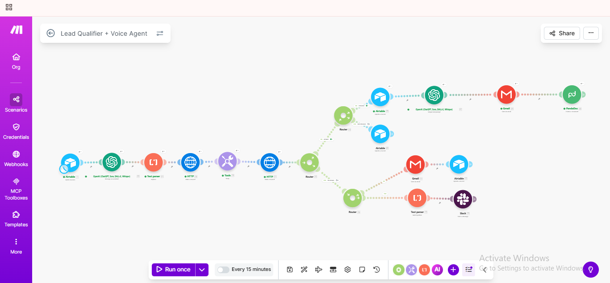
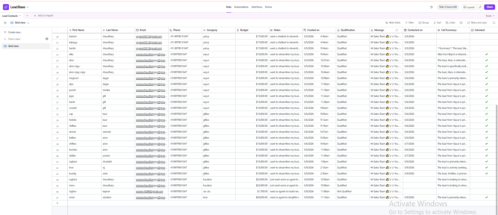
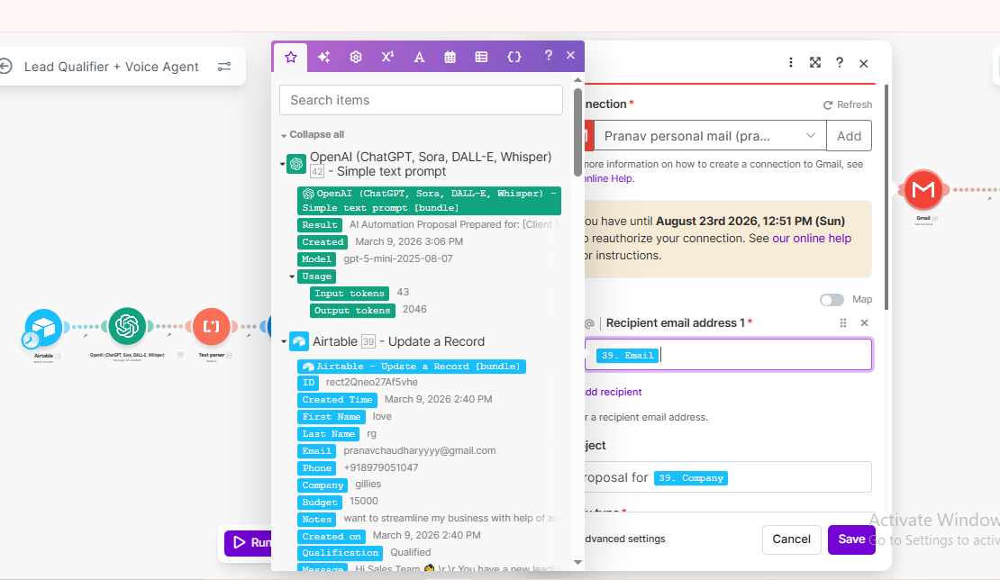
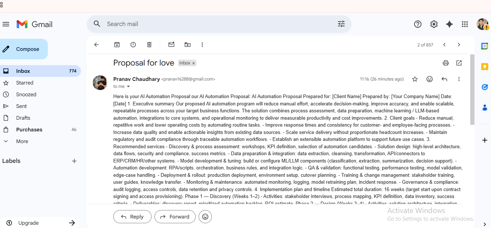
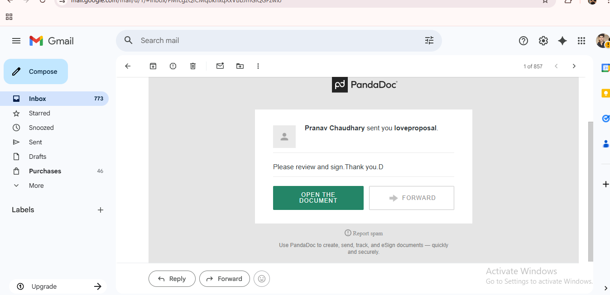

# AI Lead Qualification & Proposal Automation

## Overview
This project automates the process of qualifying leads and generating AI-powered proposals automatically.

The system collects lead information, analyzes it using AI, generates a custom proposal, and sends it to the client automatically.

## Workflow

1. Lead information is stored in Airtable
2. Make automation triggers when a new lead is added
3. OpenAI generates a personalized proposal
4. Gmail sends the proposal to the client
5. PandaDoc creates the proposal document
6. Slack receives internal notifications

## Tools Used

- Airtable (Lead database)
- Make (Automation platform)
- OpenAI (AI proposal generation)
- Gmail (Email delivery)
- PandaDoc (Proposal documents)
- Slack (Team notifications)

## System Architecture

## Example Output

AI automatically generates personalized proposals based on lead information and sends them directly to the client.

## Automation Workflow

## Airtable Lead Database

## Gmail Automation Module

## Email Received by Client

## Proposal Generated

